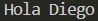

# Ejercicio 1
[Regresar al Índice](/README.md)
## Descripción del programa
Hay un nombre guardado en el programa, asi que al correrlo muestra un mensaje de bienvenida junto al nombre guardado
## Código
``` java
public class Ejercicio1 {
    public static void main(String[] args) {
        String name = "Diego";
        System.out.println("Hola " + name);
    }
}
```
## Salida esperada
