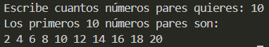

# Ejercicio 10
[Regresar al Índice](/README.md)
## Descripción del programa
Este programa le pide al usuario un rango de números y le muestra los primeros n números pares de ese rango, por ejemplo si se escoge 2, seran 2 y 4.

Además los números se ordenan en un arreglo y si imprimen en una sola línea.
## Código
``` java
import java.util.Scanner;
public class Ejercicio10 {
    public static  void main(String[] args) {
        Scanner sc = new Scanner(System.in);

        System.out.print("Escribe cuantos números pares quieres: ");
        int num = sc.nextInt();

        int[] even_num = new int[num];
        int index = 0;

        for (int i = 2; index < num; i+= 2) {
            even_num[index] = i;
            index ++;
            }
        
        System.out.println("Los primeros " + num + " números pares son:");
        for (int i = 0; i < even_num.length; i++) {
            System.out.print(+even_num[i] + " ");
        }
    }
}
```
## Salida esperada
