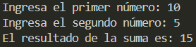

# Ejercicio 2
[Regresar al Índice](/README.md)
## Descripción del programa
El usuario escribe dos números enteros y se muestra la suma de ambos
## Código
``` java
import java.util.Scanner;
public class Ejericicio2 {
    public static void main(String[] args) {
        Scanner sc = new Scanner(System.in);

        System.out.print("Ingresa el primer número: ");
        int num1 = sc.nextInt();
        
        System.out.print("Ingresa el segundo número: ");
        int num2 = sc.nextInt();
        int result = num1 + num2;
        System.out.print("El resultado de la suma es: " + result);
    }
} 
```
## Salida esperada
