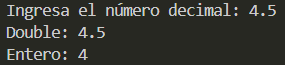

# Ejercicio 3
[Regresar al Índice](/README.md)
## Descripción del programa
Se le pide al usuario un número decimal y lo convierte a entero
## Código
``` java
import java.util.Scanner;
public class Ejercicio3 {
    public static void main(String[] args) {
        Scanner sc = new Scanner(System.in);

        System.out.print("Ingresa el número decimal: ");
        double num1 = sc.nextDouble();
        int num2 = (int) num1;
        System.out.println("Double: " +num1);
        System.out.println("Entero: " +num2);
    }
}
```
## Salida esperada
