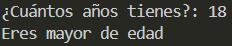

# Ejercicio 5
[Regresar al Índice](/README.md)
## Descripción del programa
Es un programa donde ingresas tu edad y te dice si eres mayor o menor de edad
## Código
``` java
import java.util.Scanner;
public class Ejercicio5 {
    public static void main(String[] args) {
        Scanner sc = new Scanner(System.in);

        System.out.print("¿Cuántos años tienes?: ");
        int age = sc.nextInt();

        if (age >= 18) {
            System.out.println("Eres mayor de edad");
        } else {
            System.out.println("Eres menor de edad");
        } 
    }
}
```
## Salida esperada
