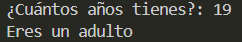

# Ejercicio 6
[Regresar al Índice](/README.md)
## Descripción del programa
El programa pregunta cuantos años tienes y en base a eso te clasifica en un grupo, si eres menor de 13 eres un niño, si eres menor de 18 eres un adolescente, si eres menor de 65 eres un adulto, y a partir de 65 eres un adulto mayor.
## Código
``` java
import java.util.Scanner;
public class Ejercicio6 {
    public static void main(String[] args) {
        Scanner sc = new Scanner(System.in);

        System.out.print("¿Cuántos años tienes?: ");
        int age = sc.nextInt();

        if (age < 13) {
            System.out.println("Eres un niño");
        } else if(age < 18) {
            System.out.println("Eres un adolescente");
        } else if(age < 65) {
            System.out.println("Eres un adulto");
        } else {
            System.out.println("Eres un adulto mayor");
        }
    }
}
```
## Salida esperada
