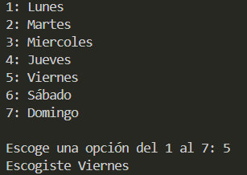

# Ejercicio 7
[Regresar al Índice](/README.md)
## Descripción del programa
El usuario tiene que escribir un número del 1 al 7, y dependiendo del número que escoja saldrá un día de la semana.
## Código
``` java
import java.util.Scanner;
public class Ejercicio7 {
    public static void main(String[] args) {
        Scanner sc = new Scanner(System.in);

        System.out.println("1: Lunes");
        System.out.println("2: Martes");
        System.out.println("3: Miercoles");
        System.out.println("4: Jueves");
        System.out.println("5: Viernes");
        System.out.println("6: Sábado");
        System.out.println("7: Domingo");
        System.out.print("\nEscoge una opción del 1 al 7: ");
        int opt = sc.nextInt();
        
        switch(opt) {
            case 1:
                System.out.println("Escogiste Lunes");
                break;
            case 2:
                System.out.println("Escogiste Martes");
                break;
            case 3:
                System.out.println("Escogiste Miercoles");
                break;
            case 4:
                System.out.println("Escogiste Jueves");
                break;
            case 5:
                System.out.println("Escogiste Viernes");
                break;
            case 6:
                System.out.println("Escogsite Sábado");
                break;
            case 7:
                System.out.println("Escogiste Domingo");
                break;
            default:
                System.out.println("Opción invalida");
        }
    }
}
```
## Salida esperada
