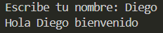

# Ejercicio 8
[Regresar al Índice](/README.md)
## Descripción del programa
En este programa hay un nombre guardado y el usuario lo tiene que escribir, aquí no importan las maýusculas o minúsculas, lo único que importa es que se escriba bien el nombre.
## Código
``` java
import java.util.Scanner;
public class Ejercicio8 {
    public static void main(String[] args) {
        Scanner sc = new Scanner(System.in);
        
        String baseName = "Diego";
        System.out.print("Escribe tu nombre: ");
        String userName = sc.next();

        if (userName.equalsIgnoreCase(baseName)) {
            System.out.println("Hola " + baseName + " bienvenido");
        } else {
            System.out.println("Hola " + userName + " tu nombre no esta guardado");
        }
    }
}
```
## Salida esperada
