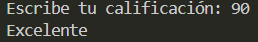

# Ejercicio 9
[Regresar al Índice](/README.md)
## Descripción del programa
El usuario tiene que escribir una calificación del 1 al 100 y dependiendo de cual sea, se clasifica en distintas categorias, si es menor de 70 esta reprobado, si es menor de 80 esta aprobado, si es menor de 90 esta muy bien, y si es mayor a 90 es excelente.
## Código
``` java
import java.util.Scanner;
public class Ejercicio9 {
    public static void main(String[] args) {
        Scanner sc = new Scanner(System.in);

        System.out.print("Escribe tu calificación: ");
        int cal = sc.nextInt();

        if (cal < 70) {
            System.out.println("Estas reprobado");
        } else if (cal < 80) {
            System.out.println("Aprobaste");
        } else if (cal < 90) {
            System.out.println("Muy bien");
        } else {
            System.out.println("Excelente");
        }
    }
}
```
## Salida esperada
