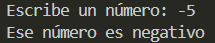

# Ejercicio 11
[Regresar al Índice](/README.md)
## Descripción del programa
El usuario tiene que escribir un número entero, y el programa lo clasifica en si es positivo, negativo o cero.
## Código
``` java
import java.util.Scanner;
public class Ejercicio11 {
    public static void main(String[] args) {
        Scanner sc = new Scanner(System.in);

        System.out.print("Escribe un número: ");
        int num = sc.nextInt();

        if (num > 0) {
            System.out.println("Ese número es positivo");
        } else if (num < 0) {
            System.out.println("Ese número es negativo");
        } else {
            System.out.println("Ese número es cero");
        }
    }
}
```
## Salida esperada
