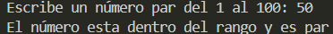

# Ejercicio 12
[Regresar al Índice](/README.md)
## Descripción del programa
El usuario tiene que escribir un número del 1 al 100 y que sea un número par, con eso muestra un mensaje diciendo que cumple los requerimientos, pero si no cumple otros, lo específica, por ejemplo si el número esta dentro del rango pero no es par, o directamente no entra en el rango.
## Código
``` java
import java.util.Scanner;
public class Ejercicio12 {
    public static void main(String[] args) {
        Scanner sc = new Scanner(System.in);

        System.out.print("Escribe un número par del 1 al 100: ");
        int num = sc.nextInt();

        if (num > 0 && num <= 100) {
            if (num % 2 == 0) {
                System.out.println("El número esta dentro del rango y es par");
            } else {
                System.out.println("El número entra dentro del rango pero no es par");
            }
            
        } else {
            System.out.println("El número no esta dentro del rango");
        }
    }
}
```
## Salida esperada
