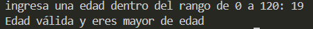

# Ejercicio 13
[Regresar al Índice](/README.md)
## Descripción del programa
Este programa verifica la validez de la edad y mayoria de edad del usuario, el rango es de 1 a 120 años, y la mayoría de edad es a partir de los 18.
## Código
``` java
import java.util.Scanner;
public class Ejercicio13 {
    public static void main(String[] args) {
        Scanner sc = new Scanner(System.in);

        System.out.print("ingresa una edad dentro del rango de 0 a 120: ");
        int num = sc.nextInt();

        if (num > 0 && num <= 120) {
            if (num >= 18) {
                System.out.println("Edad válida y eres mayor de edad");
            }
            if (num < 18) {
                System.out.println("Edad válida y eres menor de edad");
            }
            
        } else {
            System.out.println("No es una edad valida");
        }
    }
}
```
## Salida esperada
