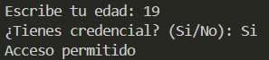

# Ejercicio 14
[Regresar al Índice](/README.md)
## Descripción del programa
Aquí se simula la entrada a una sala de cine, lo que tiene dos condiciones, que sea mayor a 14 años y si tiene credencial o no.
## Código
``` java
import java.util.Scanner;
public class Ejercicio14 {
    public static void main(String[] args) {

        Scanner sc = new Scanner(System.in);

        System.out.print("Escribe tu edad: ");
        int age = sc.nextInt();

        if (age >= 15) {
            System.out.print("¿Tienes credencial? (Si/No): ");
            String answer = sc.next();

            boolean has_answer = answer.equalsIgnoreCase("Si");
            if (has_answer) {
                System.out.println("Acceso permitido");
            } else {
                System.out.println("Acceso denegado");
            }
            
        } else {
            System.out.println("No tienes la edad permitida para entrar");
        }
    }
}
```
## Salida esperada
