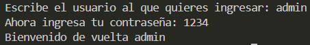

# Ejercicio 15
[Regresar al Índice](/README.md)
## Descripción del programa
Este programa tiene dos usuarios con sus respectivas contraseñas, asi que lo que el usuario tiene que hacer, es escribir correctamente el nombre del usuario al que quiere ingresar, y escribir correctamente la contraseña.
## Código
``` java
import java.util.Scanner;
public class Ejercicio15 {
    public static void main(String[] args) {

        Scanner sc = new Scanner(System.in);
        String admin = "admin";
        String admin_password = "1234";
        String user_2 = "Diego";
        String user_2_password = "4321";

        System.out.print("Escribe el usuario al que quieres ingresar: ");
        String user_name = sc.next();

        if (user_name.equalsIgnoreCase(admin)) {
            System.out.print("Ahora ingresa tu contraseña: ");
            String user_password = sc.next();

            if (user_password.equals(admin_password)) {
                System.out.println("Bienvenido de vuelta " + user_name);
            } else {
                System.out.println("La contraseña no coincide");
            }

        } else if (user_name.equalsIgnoreCase(user_2)) {
            System.out.print("Ahora ingresa tu contraseña: ");
            String user_password = sc.next();

            if (user_password.equals(user_2_password)) {
                System.out.println("Bienvenido de vuelta " + user_name);
            } else {
                System.out.println("La contraseña no coincide");
            }
        } else {
            System.out.println("Usuario inválido");
        }
    }
}
```
## Salida esperada
