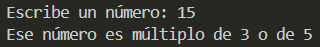

# Ejercicio 16
[Regresar al Índice](/README.md)
## Descripción del programa
En este programa se le pide al usuario que escriba un número, y se verifican dos condicioens, si es múltiplo de 3 o de 5, pero aquí solo importa que una de las condiciones se cumpla para que el número sea valido.
## Código
``` java
import java.util.Scanner;
public class Ejercicio16 {
    public static void main(String[] args) {
        
        Scanner sc = new Scanner(System.in);
        System.out.print("Escribe un número: ");
        int num = sc.nextInt();

        if (num % 3 == 0 || num % 5 == 0) {
            System.out.println("Ese número es múltiplo de 3 o de 5");
        } else {
            System.out.println("Ese número no es múltiplo de 3 o de 5");
        }
    }
}
```
## Salida esperada
